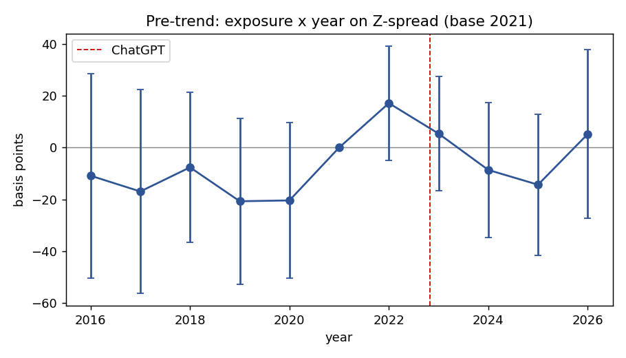
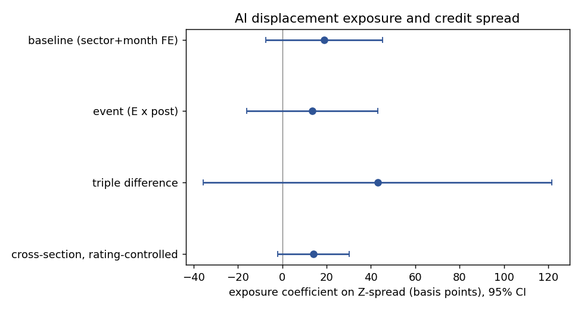

# AI displacement risk and corporate credit spreads

Does the risk that AI automates an issuer's workforce show up in the price of its
bonds? This repository builds a firm level measure of AI displacement exposure,
attaches it to the monthly Z-spread of senior unsecured USD bonds for 344
non-financial issuers from 2015 to 2026, and tests whether exposure is priced. The
short answer is no, not robustly. The point estimates lean the way the disruption
hypothesis predicts, more exposure goes with wider spreads, but they are modest and
do not clear conventional significance, except for a cross-section that conditions on
the credit rating where the effect is marginally significant.

The full write up is in [`paper/paper.md`](paper/paper.md).

## Findings

- Exposure E is industry automatability (Eloundou occupation scores weighted by BLS
  OEWS industry employment) times standardized firm labor intensity (employees over
  revenue, in USD). The interaction gives within industry firm variation that survives
  sector fixed effects.
- Baseline cross-section: a one standard deviation increase in exposure goes with about
  19 basis points of extra spread, not significant (p = 0.16).
- Event around ChatGPT and a triple difference are both positive and not significant.
- The pre-trend is flat, so the design is not manufacturing the result.
- The only specification near significance conditions on the credit rating, where
  exposure is associated with about 14 basis points of extra spread (p = 0.086).
- Adoption channel (US subset of 255 issuers): firms that discuss AI in their filings
  do not trade tighter. Both the displacement and the adoption coefficients are small,
  positive, and insignificant, so the contrast the design was built to detect does not
  separate.
- Raw Z-spreads carry errors as large as 3.3 million basis points; winsorizing the
  outcome and the exposure is the difference between noise and a usable estimate.

## How exposure is built and the join works

Bonds carry no issuer PermID in this entitlement, so each bond maps to its operating
parent through the LSEG ultimate parent identifier. This collapses finance
subsidiaries onto the parent (Ford Motor Credit onto Ford), which is the entity whose
employees and revenue define labor intensity. Fundamentals are pulled in USD so labor
intensity is comparable across issuers.

## Repository layout

```
ai-credit-risk/
├── paper/paper.md                 short paper with all results
├── code/
│   ├── 01_credit_panel.py         bond reference + Z-spread history -> issuer-month panel
│   ├── 02_credit_did.py           exposure merge, baseline, event, triple-diff, pre-trend,
│   │                              specification curve, robustness
│   └── 03_figures.py              pre-trend and coefficient figures
├── data/
│   ├── README.md                  every input, its source, and its license
│   ├── industry_exposure_4d_2025.csv   public-derived exposure by NAICS (shared)
│   └── firm_ai_intensity.csv           firm AI text measure from EDGAR (shared)
├── figures/
│   ├── fig1_pretrend.png
│   └── fig2_coefficients.png
├── requirements.txt
└── LICENSE
```

## Two figures

The pre-trend is flat, so the post 2022 comparison is not built on a pre-existing
divergence between exposed and unexposed issuers.



Across specifications the exposure coefficient is positive, more exposure goes with
wider spreads, but the confidence intervals cross zero except for the cross-section
that controls for the credit rating, which is the closest to significant.



## Reproducing the results

1. Install dependencies: `pip install -r requirements.txt`.
2. Obtain the LSEG inputs described in [`data/README.md`](data/README.md): the bond
   reference and ratings, the monthly Z-spread history, and the parent fundamentals in
   USD. These are licensed and are not included here.
3. Place the public exposure file `industry_exposure_4d_2025.csv` and, for the optional
   adoption channel, the EDGAR derived `firm_ai_intensity.csv` under `data/`.
4. Run `01_credit_panel.py`, then `02_credit_did.py`.

Scripts read from and write to `data/` and set their paths at the top of each file.

## Data note

The bond reference, spreads, ratings, and fundamentals come from LSEG under license and
are not redistributed. The exposure file is derived only from public sources (Eloundou
et al., BLS OEWS) and is shared. The `.gitignore` blocks every licensed and licensed
derived file.

## License

Code is released under the MIT License. Shared derived data follow the licenses of
their public sources, listed in `data/README.md`.
